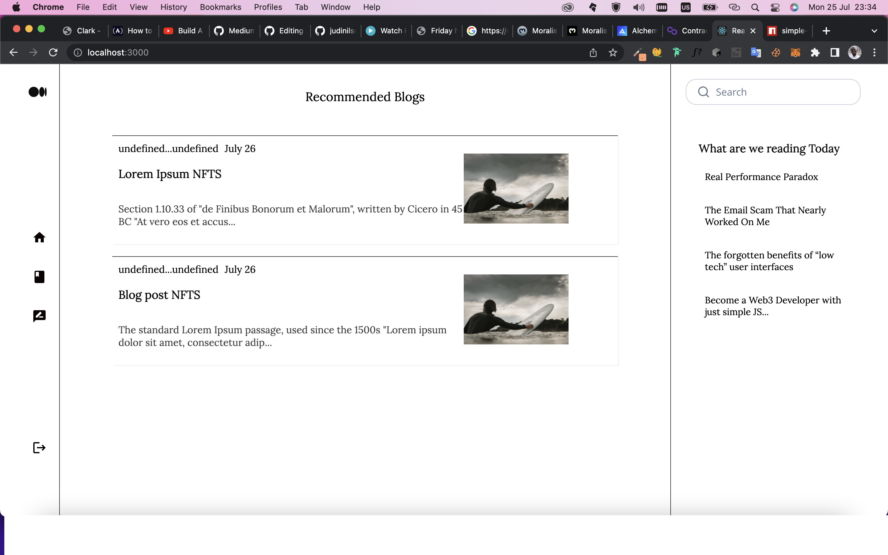

# MediumWeb3-clone

## Medium

The best ideas can change who we are. Medium is where those ideas take shape, take off, and spark powerful conversations. We’re an open platform where over 100 million readers come to find insightful and dynamic thinking.

## Poject Description

- Creating a Solidity smart contract that allows you to mint an ERC721 token.

- Using Moralis to upload blog posts/NFT content into decentralized storage on IPFS.

- Using React, to build a frontend that has the look and feel of the Medium web application.

# Project Results

### MEDIUM WEB3 CLONE LINK

# Getting Started

### Dependencies

- please install all the dependencies using yarn install

### Installing

- clone this repository by using git clone https://github.com/judinilson/MediumWeb3-clone.git
- then cd/opensea-clone folder then install the dependencies
- then cd/smart-contract folder then install the hardhat dependencies

### Executing program

- To run it use the following command
- for server npm run dev# Coinmarketcap-clone
